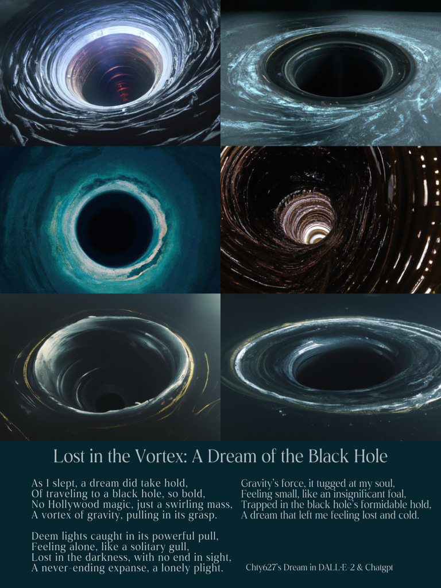
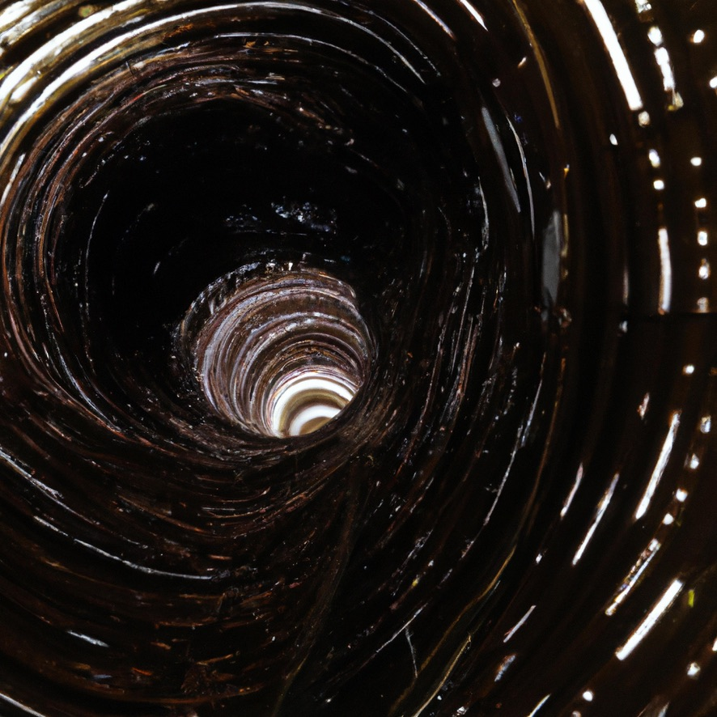

# Image Generation DALLE2
 Image Generation Simple Class Implementation using dalle2 api. Upsample process included.

I wrap everything in a simple class called `ImageGen`

And you can generate your own image using prompts and save to temporary directory, and upsample the images.

## Get Started

You can use my [Google Colab](https://colab.research.google.com/drive/1pgeowWSFfeDkM9si7ZF0MPcySPFhsRpH?usp=sharing) as a start. Remember to change you own apikey.

```
n = 4
size = "512x512"

# variation path
variation_path = "/content/a_side_table_on_a_hoverboard._Product_design._1.png"

model = ImageGen(n, size)
model.n = 4
prompt = "a moveable side table robot that follows a person around while they cook in the kitchen, allowing them to remain on a facetime call with a friend and ensuring that the iPad camera is always pointed at them for a face-to-face communication experience."

image_paths = model.generate_images(prompt, n=4)
# image_paths = model.generate_variations(variation_path)
# print(image_paths)
# model.show_images(image_paths)
```

## Example

I used this code to generate my dream someday.




